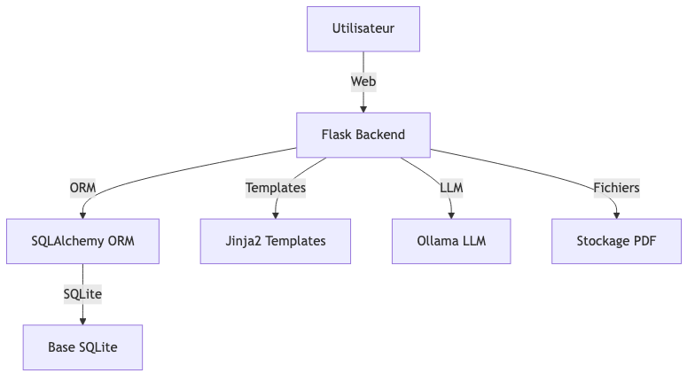
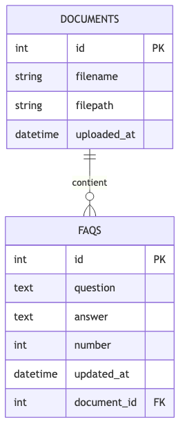
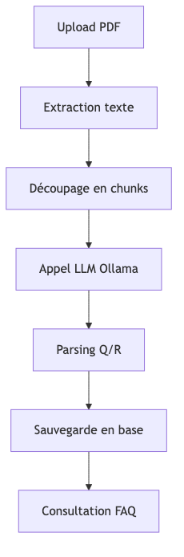
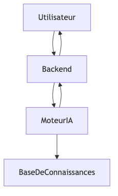
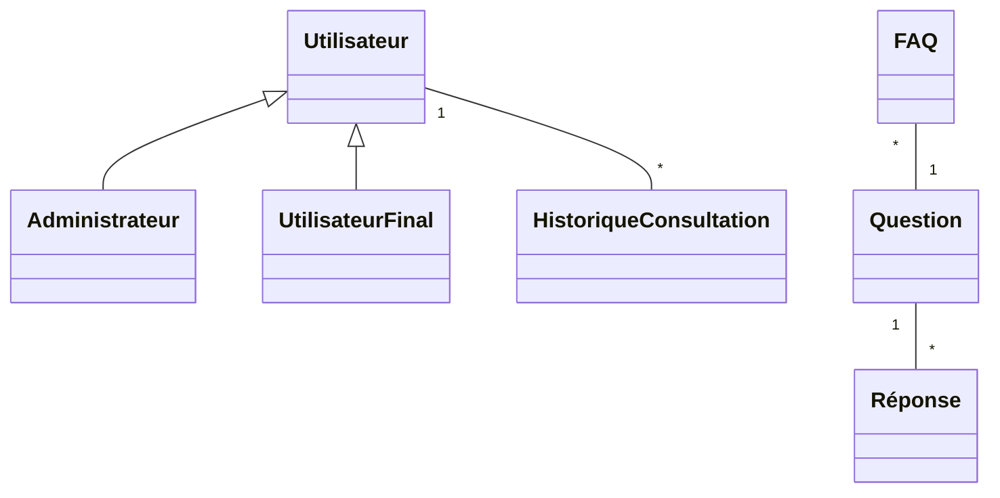

# Rapport de Conception — FAQIA

## Table des matières
1. Introduction & Contexte
2. Architecture technique
3. Fonctionnalités principales
4. Modèles de données
5. Pipeline IA (RAG)
6. Interface utilisateur (UI/UX)
7. Déploiement et dépendances
8. Annexes (diagrammes, extraits de code)

---

## 1. Introduction & Contexte

FAQIA est une application web qui permet d’uploader des documents PDF, d’en extraire automatiquement une Foire Aux Questions (FAQ) grâce à un modèle d’IA (LLM), et de consulter ou gérer ces FAQ via une interface web conviviale.

- **Public cible** : établissements éducatifs, entreprises, toute structure souhaitant automatiser la génération de FAQ à partir de documents.
- **Objectif** : réduire le temps de création de FAQ, améliorer l’accès à l’information, tout en gardant la possibilité de modifier ou enrichir les réponses.

---

## 2. Architecture technique

### Vue d’ensemble

L’application repose sur une architecture classique Flask :

- **Backend** : Flask + SQLAlchemy (ORM, base SQLite), extraction PDF (PyPDF2), IA (LangChain + Ollama)
- **Frontend** : Templates Jinja2 (HTML/CSS), navigation simple
- **Stockage** : fichiers PDF sur disque, données structurées en base


> _NB : Les labels Mermaid doivent être de la forme `[Nom]` sans parenthèses._

---

## 3. Fonctionnalités principales

### 3.1 Upload de document PDF
- Page `/upload` : formulaire d’upload, stockage du fichier sur disque, enregistrement en base (nom, chemin, date).
- Vérification de doublons, feedback utilisateur.

### 3.2 Extraction et découpage
- Extraction du texte du PDF via PyPDF2.
- Découpage en « chunks » de taille paramétrable pour faciliter l’analyse IA.

### 3.3 Génération automatique de FAQ
- Pipeline RAG : le texte du document est envoyé à un LLM (Ollama via LangChain).
- Génération de 10 questions/réponses pertinentes, formatées et stockées en base, associées au document.

### 3.4 Consultation et gestion des FAQ
- Page `/faq?document_id=...` : affichage des FAQ générées pour chaque document.
- Possibilité de relancer la génération si besoin.

### 3.5 Liste des documents
- Page `/list` : liste des documents uploadés, accès rapide à leur FAQ.

---

## 4. Modèles de données

### 4.1 Table `documents`
- `id` (PK)
- `filename` (nom du fichier)
- `filepath` (chemin sur disque)
- `uploaded_at` (date d’upload)
- Relation : une liste de FAQ

### 4.2 Table `faqs`
- `id` (PK)
- `question` (texte)
- `answer` (texte)
- `number` (ordre dans la FAQ)
- `updated_at` (date maj)
- `document_id` (FK vers `documents`)


> _NB : Les labels Mermaid doivent être de la forme `[Nom]` sans parenthèses._

---

## 5. Pipeline IA (RAG)

### Étapes clés

1. **Extraction texte PDF** : via `DocumentProcessor.extract_text_from_pdf`
2. **Découpage** : `DocumentProcessor.text_to_chunks`
3. **Prompt LLM** : génération de FAQ en français, format structuré
4. **Parsing** : extraction des Q/R de la réponse du LLM
5. **Sauvegarde** : insertion en base via SQLAlchemy


> _NB : Les labels Mermaid doivent être de la forme `[Nom]` sans parenthèses._

---

## 6. Interface utilisateur (UI/UX)

- **Accueil** : présentation du service, navigation claire.
- **Upload** : formulaire intuitif, feedback immédiat.
- **Liste des documents** : accès rapide à chaque FAQ.
- **FAQ** : affichage lisible, bouton de régénération si besoin.
- **Design** : sobre, responsive, messages flash pour l’utilisateur.

---

## 7. Déploiement et dépendances

- **Stack** : Python 3, Flask, Flask-SQLAlchemy, PyPDF2, LangChain, Ollama, Jinja2, SQLite
- **Installation** : voir `requirements.txt` (extrait ci-dessous)
- **Configuration** : chemins des fichiers, clé secrète, URI SQLite dans `database/instance.py`
- **Dépendances IA** : Ollama doit être installé/configuré pour la génération LLM.

```text
Flask==3.1.1
Flask-SQLAlchemy==3.1.1
PyPDF2==3.0.1
langchain==0.3.25
langchain-community==0.3.25
... (voir requirements.txt)
```

---

## 8. Annexes

### Extraits de code clés

- **Modèle Document** :
  ```python
  class Document(db.Model):
      __tablename__ = 'documents'
      id = db.Column(db.Integer, primary_key=True)
      filename = db.Column(db.String(255), nullable=False)
      filepath = db.Column(db.String(255), nullable=False)
      uploaded_at = db.Column(db.DateTime, default=now_paris)
      faqs = db.relationship('FAQ', backref='document', lazy=True)
  ```

- **Pipeline RAG** :
  ```python
  class RagEngine:
      def process_and_save_faqs(self, document, num_faqs=10, chunk_size=500, overlap=50):
          faqs = self.process_document_to_faqs(document, num_faqs, chunk_size, overlap)
          if faqs:
              self.save_faqs_to_database(faqs)
  ```

- **Upload de document** :
  ```python
  @app.route('/upload', methods=['GET', 'POST'])
  def upload_file():
      # ... gestion de l’upload, stockage, ajout en base ...
  ```

### Diagrammes Mermaid

- Voir section architecture et pipeline.
De nombreuses organisations sont confrontées à la répétition de questions similaires de la part de leurs utilisateurs, clients ou collaborateurs. La gestion manuelle de ces demandes entraîne une perte de temps et d’efficacité, ainsi qu’un risque d’incohérence dans les réponses apportées.

### 1.3 Objectifs
- Automatiser la réponse aux questions fréquentes grâce à l’IA
- Centraliser et structurer la base de connaissances
- Améliorer la satisfaction des utilisateurs par des réponses rapides et pertinentes
- Offrir une interface ergonomique et accessible

### 1.4 Bénéfices attendus
- Gain de temps pour les équipes support
- Réduction du volume de tickets de support
- Amélioration de la qualité des réponses
- Valorisation du savoir interne

### 1.5 Contexte technologique
L’essor des technologies d’IA (NLP, LLM, etc.) permet aujourd’hui de proposer des solutions fiables et personnalisables pour la gestion automatisée des FAQ.

---

## 2. Cahier des charges

### 2.1 Utilisateurs cibles
- Utilisateurs finaux : clients, étudiants, collaborateurs internes
- Administrateurs : responsables de la base de connaissances, support technique

### 2.2 Besoins fonctionnels
- Saisie et gestion des questions/réponses
- Recherche intelligente (mots-clés, NLP)
- Génération de réponses automatiques
- Interface d’administration (CRUD sur la base de FAQ)
- Historique et statistiques d’utilisation
- Gestion des droits d’accès (utilisateur/admin)
- Export et import de la base de connaissances

### 2.3 Besoins non fonctionnels
- Sécurité des données
- Performance (temps de réponse < 2s)
- Accessibilité (WCAG 2.1 AA)
- Compatibilité multi-plateforme (web, mobile)
- Scalabilité

### 2.4 Contraintes
- Respect du RGPD
- Hébergement sur serveurs européens
- Budget limité pour l’infrastructure
- Maintenance et évolutivité assurées sur 3 ans

### 2.5 Livrables attendus
- Application web fonctionnelle
- Documentation technique et utilisateur
- Rapport de tests
- Rapport de conception (ce document)

---

## 3. Architecture et choix techniques

### 3.1 Schémas d’architecture

#### 3.1.1 Architecture globale


*Légende : Ce schéma représente la structure générale de l’application FAQIA, incluant les flux entre utilisateur, frontend, backend, base de données, moteur IA et base de connaissances. Pour le rendre plus lisible, utilisez des couleurs différentes pour chaque composant et annotez les flèches (ex : « requête », « réponse », « authentification »).* 

- **Utilisateur** : Personne utilisant l’application (client, admin)
- **Frontend** : Interface web
- **Backend** : API et logique métier
- **BaseDeDonnees** : Système de gestion de la base de données (PostgreSQL)
- **MoteurIA** : Service IA (NLP, LLM)
- **BaseDeConnaissances** : Ensemble des documents/questions/réponses

#### 3.1.2 Base de données


*Légende : Ce schéma illustre la structure relationnelle de la base de données FAQIA, incluant les tables principales, les relations (1-n, n-n), les clés primaires et étrangères. Pour le rendre explicite, ajoutez des couleurs pour distinguer les tables principales et annexes, et détaillez les types de champs.*

- **FAQ** : regroupe les questions/réponses
- **Utilisateur** : informations de connexion et de profil
- **HistoriqueConsultation** : journal des interactions utilisateur
- **Document** : documents sources pour l’IA

#### 3.1.3 Manipulation des documents


*Légende : Ce schéma présente le flux de manipulation documentaire, de l’upload par l’utilisateur à l’indexation par l’IA, en passant par le backend et la base de données. Pour l’expliciter, ajoutez des étapes numérotées, des annotations sur les flèches (« upload », « validation », « indexation »), et des couleurs pour les flux utilisateur, backend et IA.*

- **Utilisateur** (admin/contributeur) → **Interface** (upload/édition) → **Backend** (vérification, stockage, indexation) → **BaseDeDonnees** (métadonnées) → **MoteurIA** (extraction/indexation)

#### 3.1.4 Fonctionnement de l’IA



*Légende : Ce schéma détaille le pipeline IA, du questionnement utilisateur à la génération de réponse, en passant par le backend, le moteur NLP/LLM et la base de connaissances. Pour l’expliciter, ajoutez des étapes (prétraitement, recherche, génération), des flèches annotées et des couleurs différentes pour chaque composant.*

- **Utilisateur** pose une question → **Backend** → **MoteurIA** (pipeline NLP/LLM : prétraitement, recherche, génération) → **BaseDeConnaissances** → **Réponse**

---

### 3.2 Architecture logicielle
- **Frontend** : Application web (React.js ou Vue.js)
- **Backend** : API REST (Python Flask/FastAPI)
- **Base de données** : PostgreSQL
- **Moteur IA** : Intégration d’un modèle NLP (spaCy, transformers, OpenAI API)
- **Authentification** : JWT ou OAuth2
- **Déploiement** : Docker, CI/CD (GitHub Actions)

### 3.3 Justification des choix techniques
| Composant     | Choix retenu         | Justification                      |
|---------------|----------------------|------------------------------------|
| Frontend      | React.js             | Large communauté, réutilisabilité  |
| Backend       | FastAPI              | Rapidité, documentation intégrée   |
| Base de données | PostgreSQL          | Robustesse, support avancé         |
| IA            | Transformers (HuggingFace) | Performance NLP, open source |
| Authentification | JWT                | Simplicité, sécurité               |

### 3.4 Sécurité
- Chiffrement des données sensibles
- Authentification forte
- Journalisation des accès

### 3.5 Scalabilité
- Conteneurisation avec Docker
- Possibilité de déploiement sur Kubernetes
- Architecture modulaire facilitant l’ajout de nouvelles fonctionnalités

### 3.6 Diagramme de classes simplifié



---

## 4. Développement et fonctionnalités

### 4.1 Organisation du développement
Le projet a été découpé en plusieurs phases :
- **Phase 1** : Conception de la base de données et des schémas de données
- **Phase 2** : Mise en place du backend (API, logique métier, sécurité)
- **Phase 3** : Développement du frontend (UI/UX, intégration API)
- **Phase 4** : Intégration du moteur IA (NLP, génération de réponses)
- **Phase 5** : Tests, optimisation, documentation et déploiement

#### 4.1.1 Gestion de projet
- Méthodologie agile (sprints de 2 semaines)
- Utilisation de Trello/Jira pour le suivi des tâches
- Revue de code systématique (pull requests)

### 4.2 Fonctionnalités principales

| Fonctionnalité                | Description                                                                                     |
|-------------------------------|-------------------------------------------------------------------------------------------------|
| Gestion des FAQ               | Création, modification, suppression de questions/réponses                                        |
| Recherche intelligente        | Recherche par mots-clés, NLP, similarité sémantique                                              |
| Génération automatique        | L’IA propose des réponses à partir de la base documentaire                                      |
| Historique des consultations  | Suivi des questions posées, suggestions personnalisées                                           |
| Gestion des documents         | Upload, édition, indexation, suppression de documents sources                                   |
| Statistiques et reporting     | Tableaux de bord, analyses d’usage, export CSV                                                  |
| Gestion des droits            | Rôles utilisateur/admin, gestion des accès                                                      |

#### 4.2.1 Exemple de scénario d’utilisation
1. L’utilisateur pose une question via l’interface web.
2. Le backend analyse la requête, recherche une réponse dans la base de données.
3. Si la réponse n’existe pas, le moteur IA génère une suggestion à partir des documents indexés.
4. L’utilisateur reçoit une réponse instantanée, avec la possibilité de consulter les sources.
5. L’admin peut enrichir la base de connaissances à partir des retours utilisateurs.

### 4.3 Focus technique : base de données
- Utilisation de PostgreSQL pour la robustesse et la gestion des relations complexes
- Indexation full-text sur les champs de questions/réponses
- Stockage des documents sources avec métadonnées (type, auteur, date, tags)
- Historisation des modifications (audit trail)

#### Exemple : Création d'une table FAQ en SQL
```sql
CREATE TABLE faq (
    id SERIAL PRIMARY KEY,
    question TEXT NOT NULL,
    reponse TEXT NOT NULL,
    date_creation TIMESTAMP DEFAULT CURRENT_TIMESTAMP,
    auteur VARCHAR(100),
    tags TEXT[]
);
```

#### Exemple : Indexation full-text PostgreSQL
```sql
CREATE INDEX idx_faq_question_fts ON faq USING GIN (to_tsvector('french', question));
```

### 4.4 Focus technique : manipulation documentaire
- Upload de documents (PDF, DOCX, TXT)
- Extraction automatique du texte et des métadonnées
- Indexation sémantique pour la recherche par l’IA
- Suppression sécurisée (soft delete + archivage)

#### Exemple : Endpoint FastAPI pour uploader un document
```python
from fastapi import FastAPI, UploadFile, File

app = FastAPI()

@app.post("/upload-document/")
async def upload_document(file: UploadFile = File(...)):
    content = await file.read()
    # Extraction du texte et indexation ici
    return {"filename": file.filename}
```

### 4.5 Focus technique : IA et NLP
- Utilisation de modèles pré-entraînés (transformers, spaCy)
- Pipeline : prétraitement > recherche sémantique > génération de réponse
- Fine-tuning possible sur le corpus métier
- Journalisation des requêtes IA pour amélioration continue

#### Exemple : Recherche de similarité sémantique avec spaCy
```python
import spacy
nlp = spacy.load("fr_core_news_md")

question = "Comment réinitialiser mon mot de passe ?"
doc = nlp(question)

# Exemple de base de questions
faq = [
    ("Comment changer mon mot de passe ?", "Allez dans paramètres > sécurité."),
    ("Comment contacter le support ?", "Envoyez un mail à support@faqia.com."),
]

# Recherche de la question la plus similaire
best = max(faq, key=lambda x: nlp(x[0]).similarity(doc))
print("Réponse suggérée :", best[1])
```

---

## 5. UI et UX

### 5.1 Principes de conception
- Simplicité et clarté : interface épurée, navigation intuitive
- Accessibilité : conformité WCAG 2.1 AA, contrastes, navigation clavier
- Responsive design : adaptation desktop, tablette, mobile

### 5.2 Parcours utilisateur
- **Accueil** : recherche rapide, suggestions dynamiques
- **Consultation FAQ** : affichage structuré, filtres par catégorie
- **Soumission de question** : formulaire guidé, aide contextuelle
- **Administration** : gestion centralisée des contenus, statistiques d’usage

### 5.3 Exemples de wireframes (à réaliser)
- Page d’accueil : barre de recherche, liste des FAQ populaires
- Page de gestion documentaire : tableau des documents, actions (upload, éditer, supprimer)
- Page de réponse IA : question posée, réponse générée, sources citées

### 5.4 Bonnes pratiques UX
- Feedback utilisateur immédiat (chargement, erreurs, succès)
- Messages d’aide et de validation clairs
- Historique de navigation et suggestions personnalisées
- Cohérence graphique (palette, typographie, icônes)

---

## 6. Déploiement

### 6.1 Environnement cible
- Serveur cloud (ex : AWS, OVH, Scaleway)
- Conteneurisation avec Docker
- Base de données managée (PostgreSQL as a Service)

### 6.2 Procédure de déploiement
1. Construction des images Docker (frontend, backend, IA)
2. Déploiement via CI/CD (GitHub Actions, GitLab CI)
3. Configuration des variables d’environnement (secrets, endpoints)
4. Migration de la base de données
5. Monitoring et alerting (Prometheus, Grafana)

### 6.3 Sécurité et conformité
- Utilisation de HTTPS (Let’s Encrypt)
- Sauvegardes automatisées de la base de données
- Monitoring des accès et logs
- Respect du RGPD (anonymisation, consentement)

---

## 7. Évolutions possibles

### 7.1 Fonctionnalités futures
- Ajout d’un chatbot conversationnel (web et mobile)
- Intégration d’API externes (CRM, ERP)
- Traduction automatique multilingue
- Système de recommandation personnalisé

### 7.2 Améliorations techniques
- Passage à une architecture microservices
- Optimisation du pipeline IA (modèles plus performants, vector DB)
- Mise en place d’un système de cache distribué
- Extension du support document (audio, vidéo, images)

### 7.3 Scalabilité
- Déploiement sur Kubernetes pour l’auto-scaling
- Réplication de la base de données
- Partitionnement des données volumineuses

---

## 8. Conclusions

### 8.1 Bilan du projet
Le projet FAQIA répond à un besoin réel de centralisation et d’automatisation des réponses aux questions fréquentes. L’intégration de l’IA et la structuration documentaire offrent une solution moderne, évolutive et efficace.

### 8.2 Enseignements
- L’importance d’une base documentaire riche et bien structurée
- Les défis de l’intégration IA (qualité des réponses, supervision humaine)
- La nécessité d’une interface simple et accessible pour tous les utilisateurs

### 8.3 Perspectives
Le projet est conçu pour évoluer : ajout de nouveaux modules, adaptation à d’autres contextes (éducation, santé, industrie), et intégration continue des avancées en IA et NLP.

## 9. Annexes

### 9.1 Schémas Mermaid

Les schémas suivants sont disponibles dans le dossier `schema/` au format `.mmd` (Mermaid) :
- `architecture_globale.mmd` : architecture générale de l’application
- `bdd.mmd` : structure de la base de données
- `manipulation_documents.mmd` : flux de manipulation et d’indexation des documents
- `ia.mmd` : fonctionnement du pipeline IA

Chaque schéma est accompagné d’une légende détaillée en début de fichier et de suggestions pour le rendre explicite (couleurs, annotations, étapes, etc.).

Pour visualiser un schéma :
1. Ouvrez le fichier `.mmd` dans un éditeur compatible (ex : VSCode avec l’extension Mermaid)
2. Personnalisez le schéma selon la légende pour l’adapter à votre contexte
3. Exportez-le en PNG/SVG pour l’intégrer à vos présentations ou rapports

### 9.2 Documentation technique

#### Extrait de configuration Docker pour le backend
```dockerfile
FROM python:3.11-slim
WORKDIR /app
COPY requirements.txt .
RUN pip install -r requirements.txt
COPY . .
CMD ["uvicorn", "main:app", "--host", "0.0.0.0", "--port", "8000"]
```

#### Exemple de requête API pour la recherche FAQ
```http
POST /search-faq
Content-Type: application/json
{
  "question": "Comment réinitialiser mon mot de passe ?"
}
```

_(À compléter selon les modules développés)_

### 9.3 Autres annexes
_(Ajoutez ici tout document utile à la compréhension et à la maintenance du projet)_

